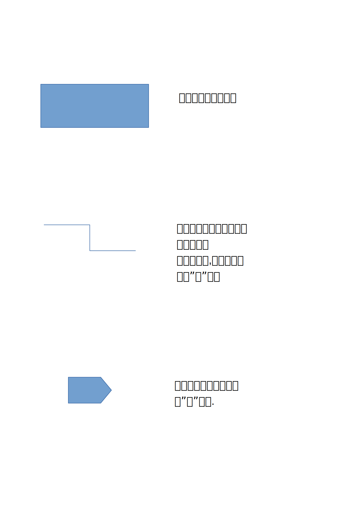
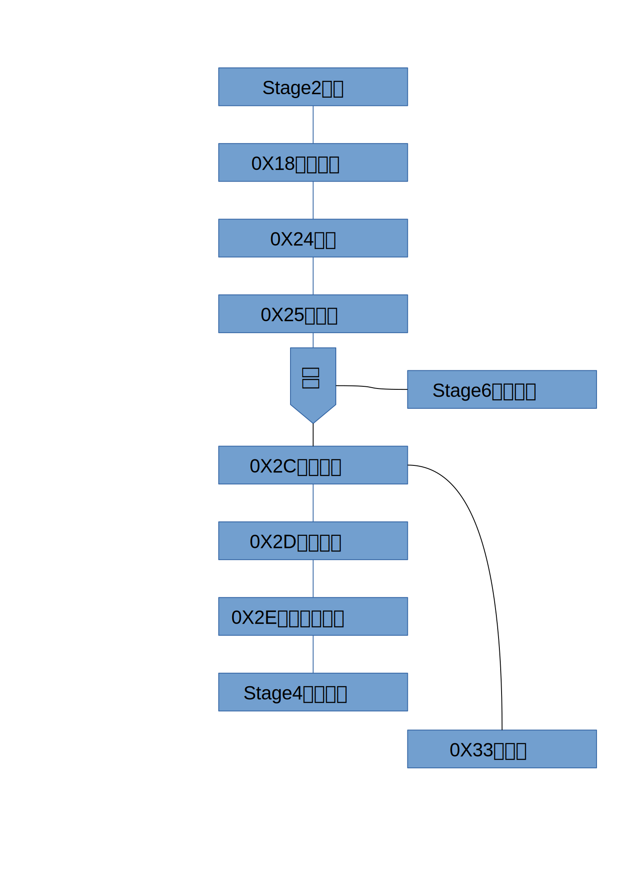
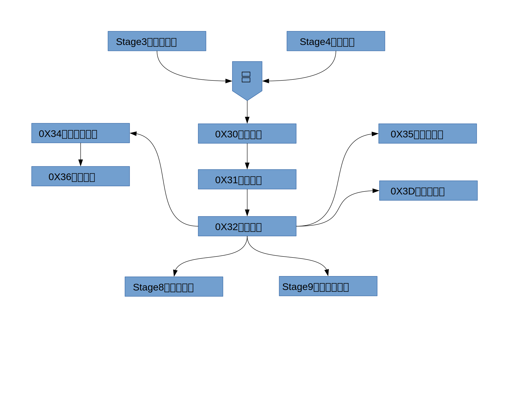
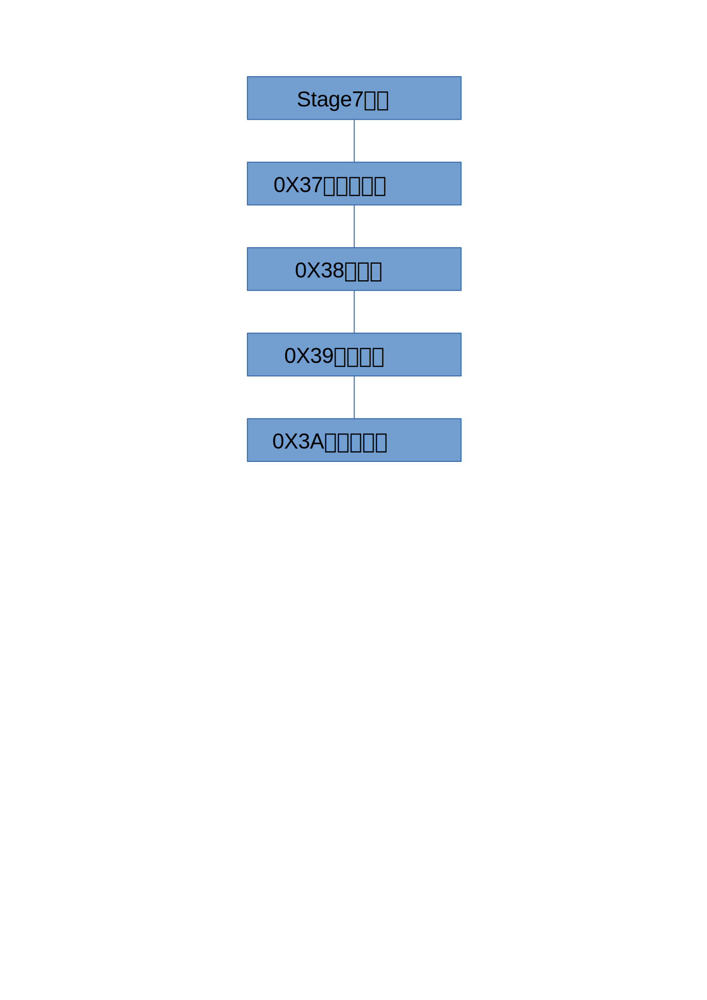
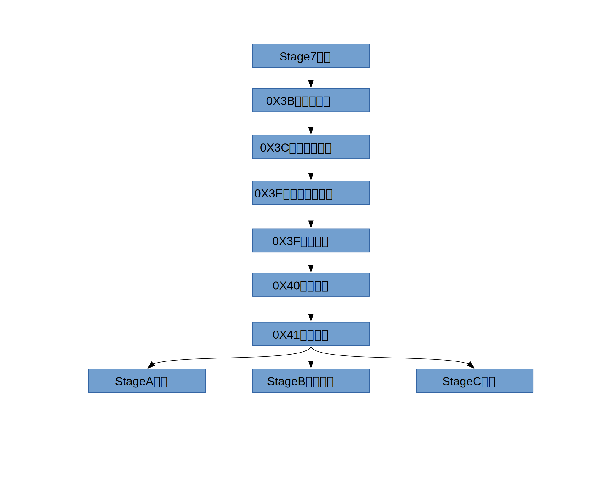

# 目录

## 图例

## Stage1 入门

## Stage2 基础

## Stage3 字符串处理

## Stage4 理解函数

## Stage5 表结构

## Stage6 流程控制

## Stage7 模块

## Stage8 正则表达式

## Stage9 虚拟机和文件

## StageA 元表

## StageB 异常处理

## StageC 线程

s

## StageD 调试

前置:Stage1~C

0X49 调试
0X4A Hooks

后续:暂无