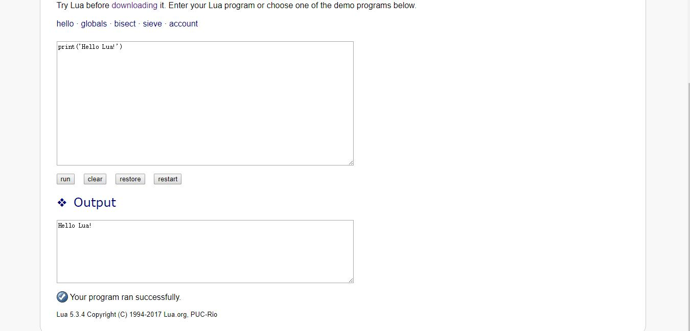

# 0X02Hello Lua!
## 前置知识
* 0X01简介
## 正文
1. 如果你迫不及待地想要尝试Lua，可以在官网上找到网页版lua虚拟机demo。这里可以实验简单的lua代码。（注：在线虚拟机在官网>get started>Installing>live demo。）
2. 在线demo又一个供我们输入程序的地方。点击run按钮就会运行程序，并且在下方出现另一个名为“Output”的窗口用于显示程序运行的结果。  
3. 输入程序
    >```
    >print('Hello Lua!')
    >```
    然后按执行按钮。下方结果就会输出“Hello Lua!”。恭喜你，刚刚运行成功了你的第一个Lua程序。  
    
4. 简单解释一下，print表示输出一些东西，在其后的括号里的是要输出的内容。这里只有一项内容要输出，是一串英文字符。在编程中我们称之为字符串。这里用单引号引起来表示是一个字符串，其中的内容会被输出到下方的输出区域。注意：
    * 字符串的内容不包括标识字符串的首尾的引号。
    * 如果不用引号标示。“Hello”和“Lua!”会被当成变量名或拼写错误的标识符。总之就会被误解为其他意思，而不是作为一串字符，被print函数输出。
5. 稍有计算机常识的人都明白，计算机的工作基于芯片中进行的二进制运算。我们所写的“print”之类的东西并非计算机硬件能直接处理的命令。因此从我们输入程序文本到最终计算机执行的过程中，需要一个软件程序做转换工作。把人能看懂的文本翻译为计算机能执行的命令。
6. 我们所写的这个翻译之前的文本——本例中的“print('Hello Lua!')”——就叫做程序源码。下一节将介绍从程序源码到计算机可执行的指令的大致原理。
## 后续推荐
* 0X03虚拟机程序
