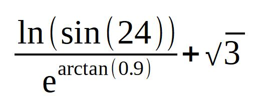

# 0X0E中学算术
## 前置知识
* 0X0D数学库函数
## 正文
1. 有了三角函数、反三角函数、对数函数、求幂运算，中学阶段涉及的所有具体的数值计算基本就都可以求解。对于分段函数、狄利克雷函数这类需要逻辑判断的函数还需要学习选择结构才能处理。
2. 求此表达式的值：
    
3. 第2点中提出的习题，只需要简单转化为Lua中的表达式即可。也可以分为多步计算，用变量保存中间值。这里直接转换：
    >```
    >math.log(-math.sin(24))/math.exp(math.asin(0.9))+math.sqrt(3)
    >```
    结果是约为1.69968。
4. 解释一下题中的函数用法。一个函数的返回值可以作为另一个函数的实参。因此可以把一个含有函数调用的表达式写在另一个函数调用的参数位置。
5. 需要注意的是，很多中学的数学题还不能直接通过算术求解。例如求函数的值域、定义域。本质上不是从数到数的计算，而是从函数到数或者从函数到区间的运算。想要靠程序完全自动解决这类问题，还需要用到更多的Lua知识。
## 后续推荐
* 暂无