# TXLuaLesson

TaiXuan's Programming Language Lua Lesson

太玄的Lua编程语言课。

## Introduction

This is a series of articles and related videos that I have completed on and off over a long period of time. Its main content is a basic tutorial on Lua. This project is now complete. I have no plans to expand this tutorial for now.

这是我在较长一段时间内断断续续完成的一系列文章以及相关视频。其主要内容是 Lua 的基础教程。现在这一项目已经完成。我目前没有继续拓展这一教程的计划。

This document uses Mermaid syntax to describe the relationships between lessons. Therefore please view this document using a Markdown editor that supports Mermaid rendering.

该文档使用 Mermaid 语法描述了课程之间的关系。因此请使用支持 Mermaid 渲染的 Markdown 编辑器查看本文档。

The project's video files are in the `Videos` folder. I used Git LFS to manage these video files. When cloning the repository, be sure to use the Git LFS command to download the video (please refer to <https://git-lfs.com/>).

该项目的视频文件早 `Videos` 文件夹中。我使用了 Git LFS 来管理这些视频文件。在克隆该仓库的时候注意使用 Git LFS 命令下载视频（请参考<https://git-lfs.com/>）。

## Table of Content

图例：

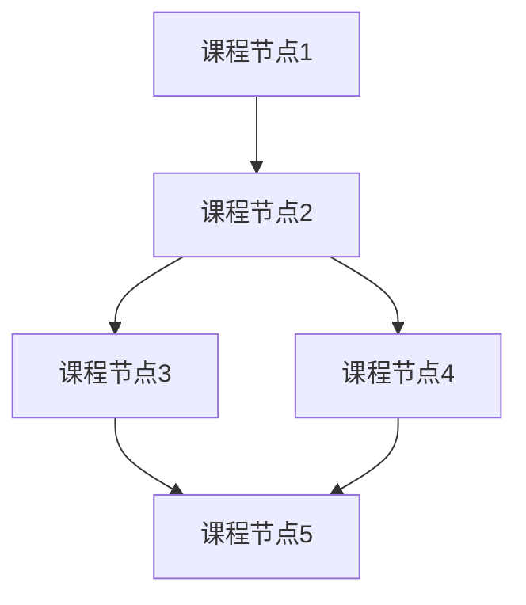

节点间的连线表示学习顺序关系。当一个课程节点有多个指向它的箭头时，需要把每一个箭头出发点都学完再学习它。当一个课程节点发出多个箭头时，选择一个自己感兴趣的优先学习即可。

此外，在 `Videos` 文件夹中有部分课程中提到的例子的视频演示。这些视频使用 Git LFS 上传，因此克隆仓库时请注意使用 Git LFS。

### Stage0 前言

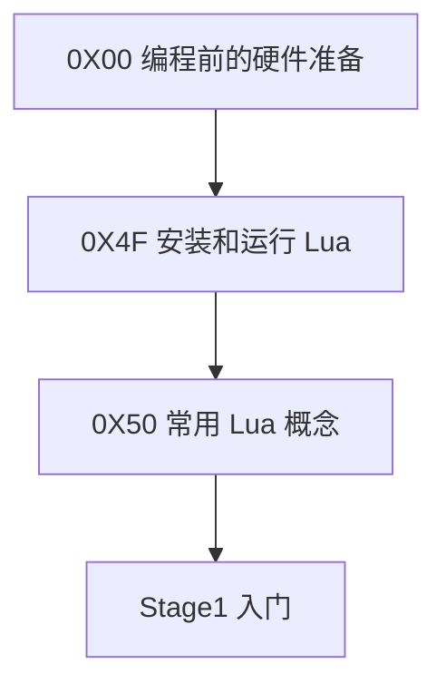

* [0X00 编程前的硬件准备](./Stage0/0X00编程前的硬件准备.md)
* [0X4F 安装和运行 Lua](./Stage0/0X4F安装和运行Lua.md)
* [0X50 常用 Lua 概念](./Stage0/0X50常用Lua概念.md)

### Stage1 入门

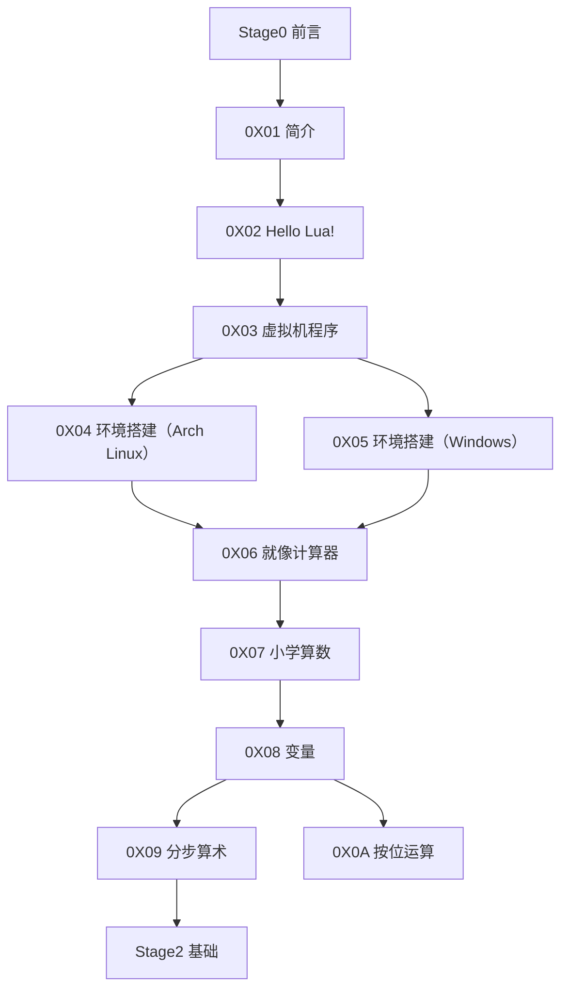

* [0X01 简介](./Stage1/0X01简介.md)
* [0X02 Hello Lua](./Stage1/0X02HelloLua.md)
* [0X03 虚拟机程序](./Stage1/0X03虚拟机程序.md)
* [0X04 环境搭建（Arch Linux）](./Stage1/0X04环境搭建（Arch_Linux）.md)
* [0X05 环境搭建（Windows）](./Stage1/0X05环境搭建（Windows）.md)
* [0X06 就像计算器](./Stage1/0X06就像计算器.md)
* [0X07 小学算数](./Stage1/0X07小学算数.md)
* [0X08 变量](./Stage1/0X08变量.md)
* [0X09 分步算术](./Stage1/0X09分步算术.md)
* [0X0A 按位运算](./Stage1/0X0A按位运算.md)

### Stage2 基础

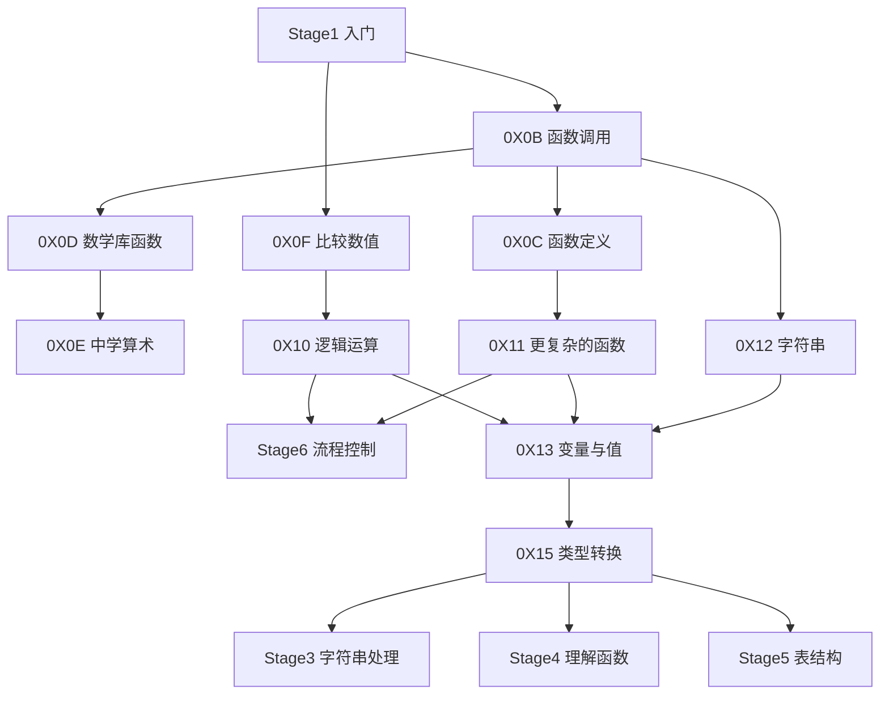

* [0X0B 函数调用](./Stage2/0X0B函数调用.md)
* [0X0C 函数定义](./Stage2/0X0C函数定义.md)
* [0X0D 数学库函数](./Stage2/0X0D数学库函数.md)
* [0X0E 中学算术](./Stage2/0X0E中学算术.md)
* [0X0F 比较数值](./Stage2/0X0F比较数值.md)
* [0X10 逻辑运算](./Stage2/0X10逻辑运算.md)
* [0X11 更复杂的函数](./Stage2/0X11更复杂的函数.md)
* [0X12 字符串](./Stage2/0X12字符串.md)
* [0X13 变量与值](./Stage2/0X13变量与值.md)
* [0X15 类型转换](./Stage2/0X15类型转换.md)

### Stage3 字符串处理

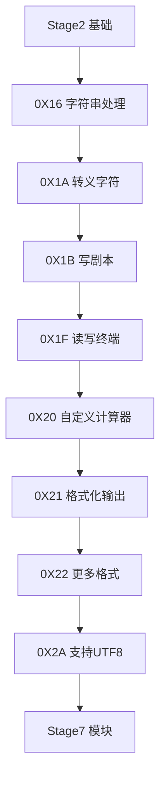

* [0X16 字符串处理](./Stage3/0X16字符串处理.md)
* [0X1A 转义字符](./Stage3/0X1A转义字符.md)
* [0X1B 写剧本](./Stage3/0X1B写剧本.md)
* [0X1F 读写终端](./Stage3/0X1F读写终端.md)
* [0X20 自定义计算器](./Stage3/0X20自定义计算器.md)
* [0X21 格式化输出](./Stage3/0X21格式化输出.md)
* [0X22 更多格式](./Stage3/0X22更多格式.md)
* [0X2A 支持UTF8](./Stage3/0X2A支持UTF8.md)

### Stage4 理解函数

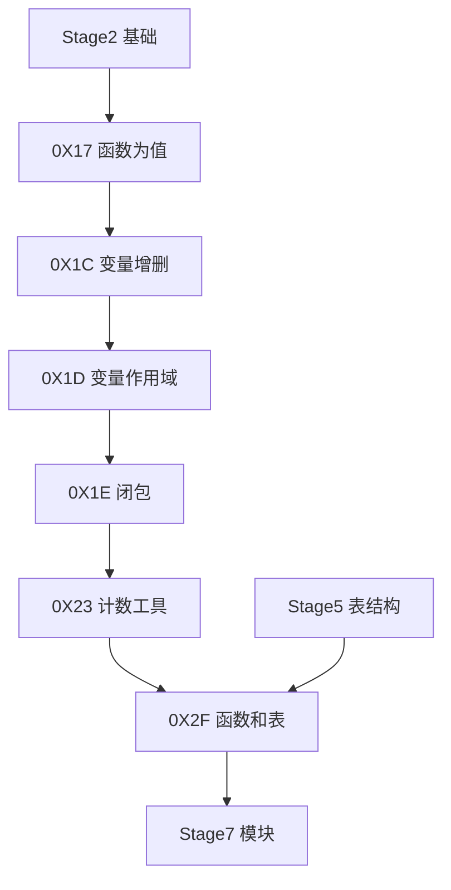

* [0X17 函数为值](./Stage4/0X17函数为值.md)
* [0X1C 变量增删](./Stage4/0X1C变量增删.md)
* [0X1D 变量作用域](./Stage4/0X1D变量作用域.md)
* [0X1E 闭包](./Stage4/0X1E闭包.md)
* [0X23 计数工具](./Stage4/0X23计数工具.md)
* [0X2F 函数和表](./Stage4/0X2F函数和表.md)

### Stage5 表结构

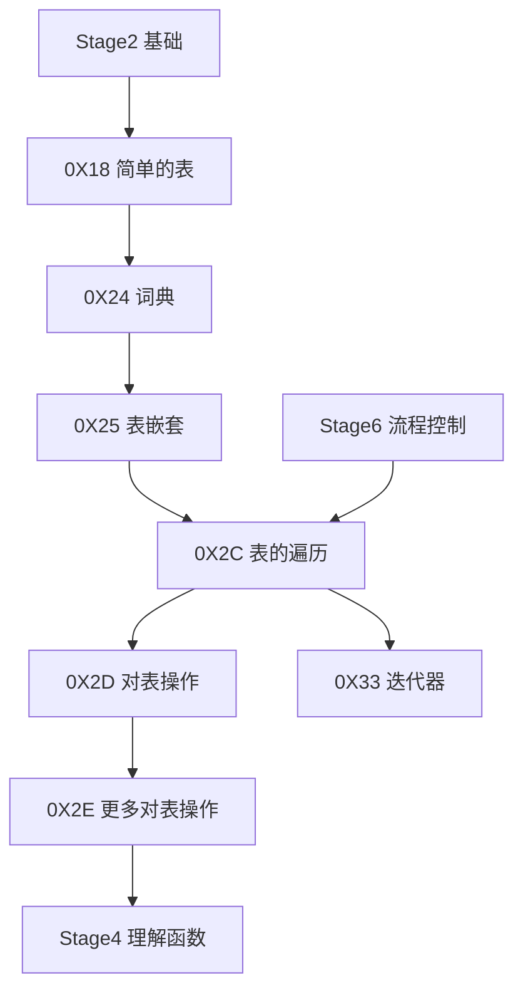

* [0X18 简单的表](./Stage5/0X18简单的表.md)
* [0X24 词典](./Stage5/0X24词典.md)
* [0X25 表嵌套](./Stage5/0X25表嵌套.md)
* [0X2C 表的遍历](./Stage5/0X2C表的遍历.md)
* [0X2D 对表操作](./Stage5/0X2D对表操作.md)
* [0X2E 更多对表操作](./Stage5/0X2E更多对表操作.md)
* [0X33 迭代器](./Stage5/0X33迭代器.md)

### Stage6 流程控制

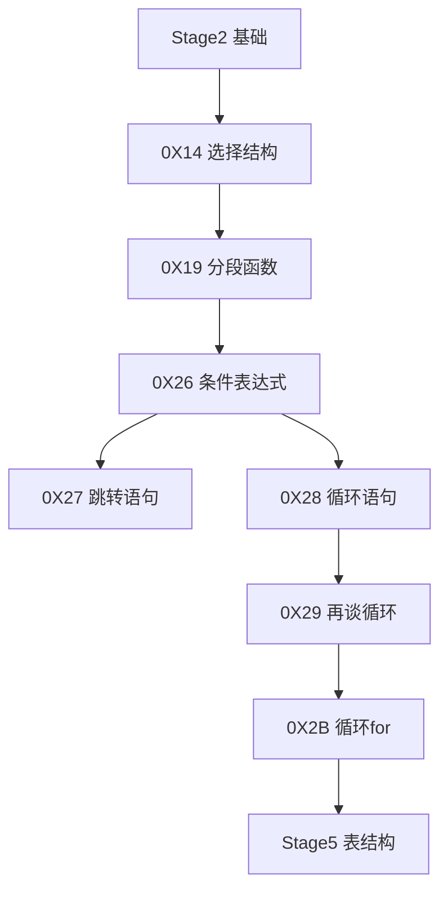

* [0X14 选择结构](./Stage6/0X14选择结构.md)
* [0X19 分段函数](./Stage6/0X19分段函数.md)
* [0X26 条件表达式](./Stage6/0X26条件表达式.md)
* [0X27 跳转语句](./Stage6/0X27跳转语句.md)
* [0X28 循环语句](./Stage6/0X28循环语句.md)
* [0X29 再谈循环](./Stage6/0X29再谈循环.md)
* [0X2B 循环for](./Stage6/0X2B循环for.md)

### Stage7 模块

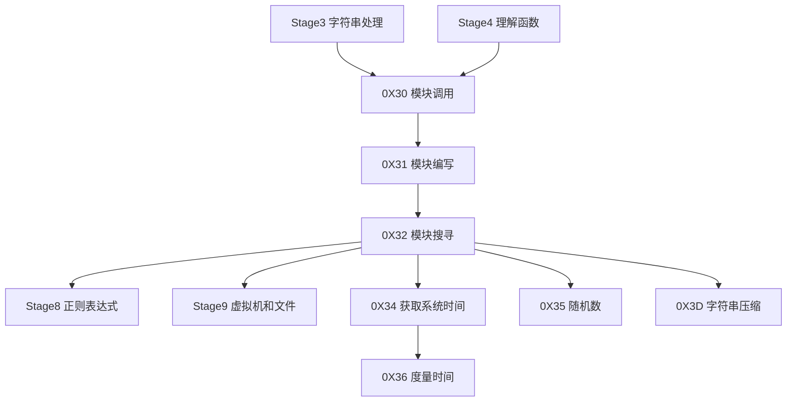

* [0X30 模块调用](./Stage7/0X30模块调用.md)
* [0X31 模块编写](./Stage7/0X31模块编写.md)
* [0X32 模块搜寻](./Stage7/0X32模块搜寻.md)
* [0X34 获取系统时间](./Stage7/0X34获取系统时间.md)
* [0X35 随机数](./Stage7/0X35随机数.md)
* [0X36 度量时间](./Stage7/0X36度量时间.md)
* [0X3D 字符串压缩](./Stage7/0X3D字符串压缩.md)

### Stage8 正则表达式

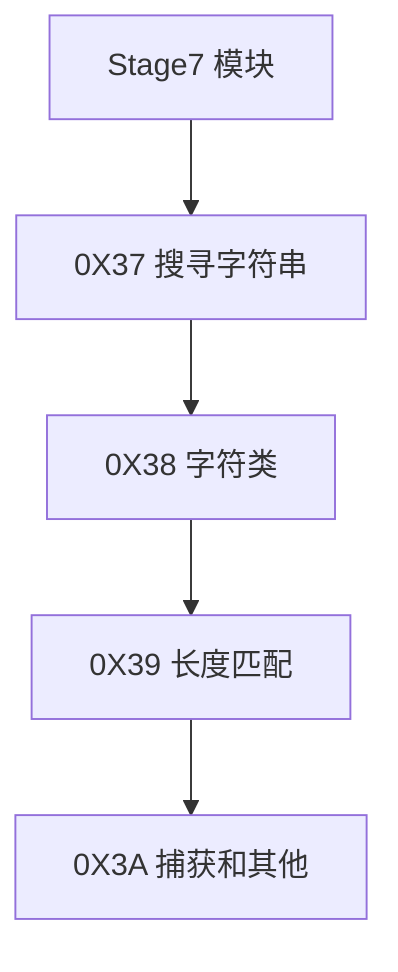

* [0X37 搜寻字符串](./Stage8/0X37搜寻字符串.md)
* [0X38 字符类](./Stage8/0X38字符类.md)
* [0X39 长度匹配](./Stage8/0X39长度匹配.md)
* [0X3A 捕获和其他](./Stage8/0X3A捕获和其他.md)

### Stage9 虚拟机和文件

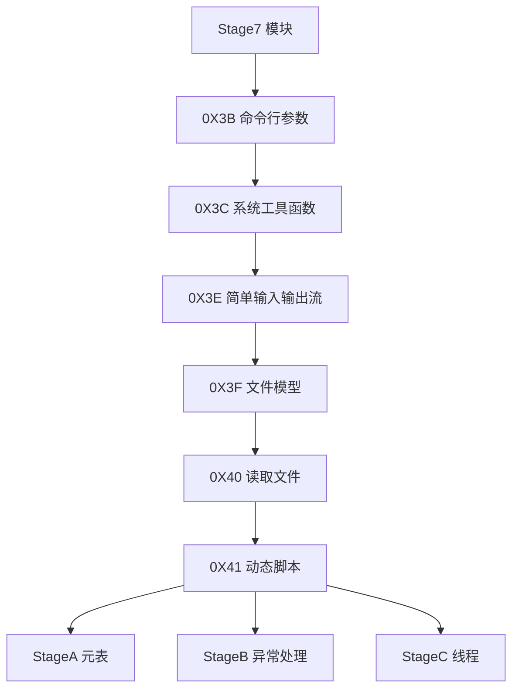

* [0X3B 命令行参数](./Stage9/0X3B命令行参数.md)
* [0X3C 系统工具函数](./Stage9/0X3C系统工具函数.md)
* [0X3E 简单输入输出流](./Stage9/0X3E简单输入输出流.md)
* [0X3F 文件模型](./Stage9/0X3F文件模型.md)
* [0X40 读取文件](./Stage9/0X40读取文件.md)
* [0X41 动态脚本](./Stage9/0X41动态脚本.md)

### StageA 元表

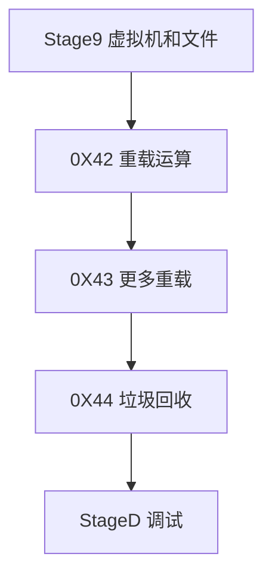

* [0X42 重载运算](./StageA/0X42重载运算.md)
* [0X43 更多重载](./StageA/0X43更多重载.md)
* [0X44 垃圾回收](./StageA/0X44垃圾回收.md)

### StageB 异常处理

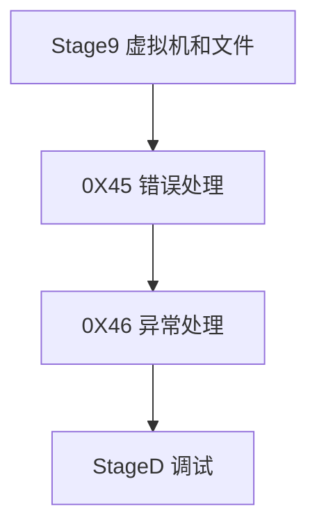

* [0X45 错误处理](./StageB/0X45错误处理.md)
* [0X46 异常处理](./StageB/0X46异常处理.md)

### StageC 线程

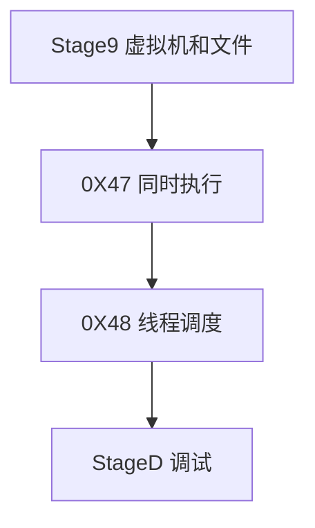

* [0X47 同时执行](./StageC/0X47同时执行.md)
* [0X48 线程调度](./StageC/0X48线程调度.md)

### StageD 调试

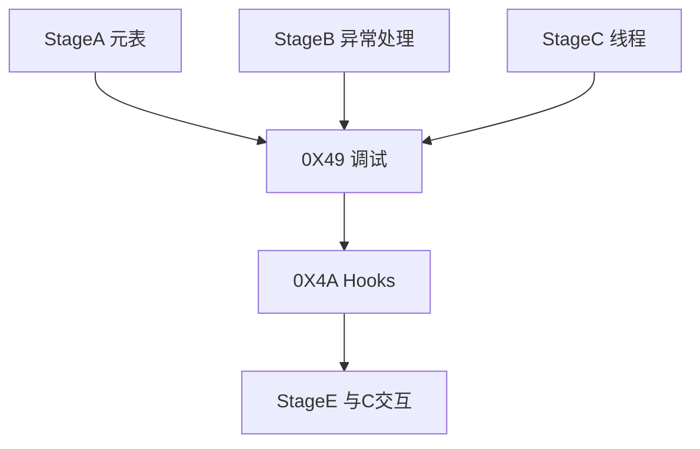

* [0X49 调试](./StageD/0X49调试.md)
* [0X4A Hooks](./StageD/0X4AHooks.md)

### StageE 与C交互

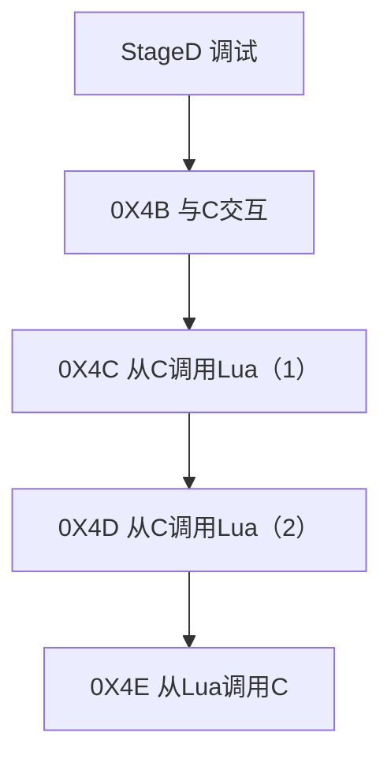

* [0X4B 与C交互](./StageE/0X4B与C交互.md)
* [0X4C 从C调用Lua（1）](./StageE/0X4C从C调用Lua（1）.md)
* [0X4D 从C调用Lua（2）](./StageE/0X4D从C调用Lua（2）.md)
* [0X4E 从Lua调用C](./StageE/0X4E从Lua调用C.md)

## Todo List

* [ ] 重新整理章节。均衡章节容量。重新安排章节顺序和目录（删除原有图片目录）。
* [ ] 修复图片链接。数学公式全部使用Katex。流程图等全部使用mermaid绘制，通过图片链接加入。（需要等待编译器增加移动图片功能和保持目录结构，保持相对链接功能。）（或者命令本身只能处理一层路径，但是用shell编程来解决目录递归的问题。）
* [ ] 短视频用gif动图替换。
* [ ] 计划以后使用makefile来管理文件的编译工作。
* [ ] 每个课程使用一个文件夹来包含。
* [ ] 第一个大部分——Lua的教程和编程语言基础。第二个大部分——C语言及其相关内容。
* [ ] 交互式编程环境中相当于一个大的命名空间。
* [ ] 把演示视频合并进来。

## Update Record

### 2024.05.11

* 重新审视该项目并做出一些整理，取消了过于宏大的后续计划。由于Lua教程部分已经比较完整，在完成一些基本的整理工作之后，完结该项目。

### 2019.03.22

* 计划增加有关于C和Linux的有关内容。修改文件目录结构，增加C相关的计划。

### 2018.08.08

* 完成了写作和视频。

### 2018.4.2

* 完成了最后的Lua C API章节。本教程至此告一段落。

### 2018.3.7

* 重新确立了文件的保存备份和分享办法。具体措施如下：
  * 所有文本性内容（包括SVG等文本描述的图片文件）保存备份于Github。
  * 除了文本性内容以外的内容将会依照原有的目录格式备份于百度云盘。这部分文件也可以用于分享下载。
  * 所有文本性和非文本性的内容整体打包保存于坚果云。（等我弄清楚怎么用坚果云分享，我也会把这一部分链接分享。）
  * 视频类内容和文章还会在bilibili发表。

### 2018.1.3

* 移除了所有的视频文件和除svg以外的图片文件.因为git并不适合作为备份工具,github也不适合作为通用云盘.以后在github仓库中将仅仅存放纯文本或者仅基于纯文本的文件.
* 更新了一些内部图片链接.
* 新增章节0X49和0X4A.新增阶段StageD.
* 更新了0X01中的学习资料索引.

----

# Part 01 准备工作

我一直很羡慕能把编程讲得很优雅，很有趣的人。
也一直希望我能像他们一样以简单有趣的方式向别人传播编程知识。
但我发现我做不到。因为编程本身就是复杂的。如果要让课程简单有趣，就必然牺牲准确性。而对我来说，准确严谨比通俗易懂重要得多。

因此我不会强求这个系列的教程通俗易懂，我只会尽量让它好读一些。 希望读者也不要强求我。说明了这一点，我觉得我们可以书归正传了。

这个教程试图向读者普及一些基本的编程知识。我希望读者在学完这些教程之后有能力写一些小程序来娱乐自己或者减轻正在承受的重复劳作之苦。按照计算机知识的结构，我会在教程中涉及一些理论知识。但是我更希望这个教程能教人写一些程序，而不是做算法复杂性的推导计算。

> 如果我真的讲算法复杂性的推导和计算。恐怕这个教程的读者数得除以10。

工欲善其事，必先利其器。在开始正式的编程语言课程之前，我们需要做一些准备工作。这些准备工作既包括工具方面的准备，也包括前置知识的复习（或者预习）。这些就是这个章节的主要内容。一般教程会推荐有一定基础的读者跳过这种做准备工作的章节。但是我不推荐读者这么做。因为读这个教程的读者无非两种——会编程的和不会编程的。会编程的读者完全可以跳过这整本书。而不会编程的读者又为什么要把最简单，最容易上手的第一章跳过呢？

在这个准备章节中，我会探讨开始编程学习所需要的各种软硬件条件，列举我认为所必须的前置知识，然后以一种名为Lua的简单编程语言为例，说明编程中的基本概念。需要注意的是，编程所涉及的知识量非常庞大。我在这个章节所作的的介绍仅仅是其中一小部分。
