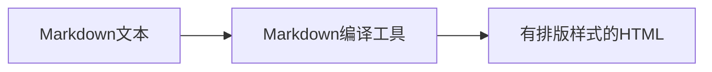

# Markdown（1）

之前我们讨论了纯文本编辑器。有了编辑器当然要写点什么。比如写写日记，小说或者给博客打个草稿。等用纯文本编辑器写东西的新鲜劲过去之后，可能你会发现这东西几乎不支持任何排版样式，连加粗和放大标题字号都做不到。这样一篇不做任何排版的文章拿给人看，对于阅读者来说也太不友好了。

这时你可以试试用Markdown来写文章。Markdown是一门标记语言。它在纯文本的基础上约定了若干规则。只要你写纯文本的时候遵守这些规则，你写出来的就是一份符合规范的Markdown文本。然后你需要一个Markdown编译工具。这是一个软件，用它可以把你写的Markdown文本编译为HTML文本（或者PDF或者别的什么文件格式）。用浏览器打开生成的HTML（或者用阅读器打开生成的PDF），你就会发现你写的纯文本变成了有格式有排版的样子。



图1：Markdown的大致编译流程

说起来，可能有点麻烦。但实际上，只要你找好编辑工具，这些工具自动就会完成这些中间过程。你不需要操心编译之类的中间过程。只需要写Markdown，看结果，写Markdown，看结果就行了。

.assets/1539868880913.png)

图2：VSCode中写Markdown。左侧是实际写的内容，右侧是编译后效果的预览。

## Markdown的原理

我们写的Markdown源码本身是没有显示出排版效果的。但是经过编译却有了排版样式。如果你仔细对比图2的左右两边又会发现，有一些字符我在左侧源码中写了但是在右侧却没有显示出来。这都和Markdown的原理有关。

之前在讨论控制字符的时候，我提到过。排版样式也是信息的一种。在写源码的时候，我按照Markdown的语法，用一些约定好的字符串（例如`##`，`**`）来标记一段内容文字的排版样式（比如`##`表示 二级标题，`**`表示加粗）。Markdown的编译器处理我写的原文时，遇到这些标记，就按照Markdown语法的约定，将这些标记所标记的文本段落转化成标记对应的样式。由于标记至此已经完成了传递排版样式信息的使命，所以Markdown编译器会在完成编译后删除这些标记。这样就有了图2右边的显示效果。

## 为什么要用Markdown

Markdown不是程序员的专利。任何人都可以用Markdown写东西。

对比什么格式都不用的纯文本而言，Markdown的好处显而易见。在经过编译后Markdown文本能变成带有排版效果的HTML（或者PDF等）。导出的成品比干巴巴的纯文本好看得多。

那为什不用Word之类的编辑器呢？什么情况下用Markdown会比Word更好呢？

我认为Markdown对比Word，优势在于简洁，精确和逻辑清晰。

先来说简洁。Markdown支持的格式就那么几种（即使拓展后也不太多），刚刚够用。因此对应的语法也就那么几条，学起来也没多困难。而Word中可用的字体，字号，颜色，样式，功能都太多了。这些冗余的东西经常会干扰思路。另外，虽然Word不用学语法也能用，但是你需要记忆各种操作。我用Word就经常迷失在找一个功能按钮的过程中。

然后是精确。Markdown中所有的信息都在Markdown源码中。无论是内容还是格式标记你都能清清楚楚地看到。你写了什么格式，渲染出来就是什么样式。而Word中就麻烦了。由于Word经常只给你看效果，而不告诉你这一段效果是怎么设置的。你就不得不陷入这样的思考：我这一退格下去，究竟是删掉了行首的缩进还是上一行末尾的回车？

最后，逻辑清晰。就像Unicode只做字符编码，而不做字体，Markdown会标记一段文字是标题，但是不会规定标题应该用什么字体，用几号字。Markdown的标记标记的是文章结构，而非样式。你在做标记的时候，其实是在整理文章的思路。用Markdown写文章，更容易把排版样式和文章的结构结合起来。而用Word，你可能早就被淹没在茫茫多的样式中，无暇顾及文章的逻辑结构了。

>Word其实也有大纲功能。不过，不知道有多少人记得经常用这个功能（或者有多少人知道有这个功能）。另外，Word在文章结构标记功能上设计得不太好。如果你写的时候不注意标记，可能最终用大纲功能也提取不出多少有用的结构来。

> **如何控制Markdown的样式**
>
> Markdown语法只是用来标记文章结构，文章格式的。具体一段被标记了有特殊排版效果的文字显示成什么样是编译器决定的。不过大多数Markdown的编辑工具（或者编译工具）支持用CSS（或者其他配置文件）指定渲染样式。比如Markdown中标记了一级标题，二级标题，加粗，引用等格式。你可以写一个CSS在其中具体定义一级标题用什么字体，二级标题用什么颜色，加粗加多粗，引用怎么表示等等。
>
> 由于每个编辑工具或者编译工具的设置方式有所不同，我就不在这里详细介绍了。请参考你用的工具的说明书进行配置。

## Markdown用在哪里

首先，自己在自己电脑上用来记日记，写文章肯定是可以的。一些博客网站，论坛网站也支持用Markdown的格式发帖子（写Markdown源码，发出来是渲染后的样式）。一些笔记工具支持用Markdown格式来记笔记。

代码托管网站Github可以用Markdown给项目写说明页。Jupyter中可以用Markdown给代码加注释。还有很多地方用Markdown格式写程序的说明文档。另外还有像我这样的人用Markdown来写写教程什么的。如果有兴趣，你也可以上GitBook用Markdown写书。

除了以上列举的情景，其实不管哪里，只要你想用Markdown就可以试试用Markdown来写东西。

## 如何编译Markdown

这一段纯属满足好奇宝宝们的好奇心。如果对程序不太感兴趣，也没有这个好奇心，还是跳到下一段，选一个好用的Markdown编写工具吧。

Markdown的编译工具有很多，比如基于JavaScript的markdown-it。要在自己电脑上使用这个工具，需要先安装node.js，然后从npm下载安装markdown-it。接着写一个小脚本来调用markdown-it编译你的Markdown文本。其实就是调用一个函数markdown-it的函数，输入一个Markdown字符串输出一个HTML字符串。这里有个简单的例子。

```js
md=require('markdown-it')()
mytext='# hello\nI\'m**TaiXuan**'
myhtml=md.render(mytext)
console.log(myhtml)
```

也可以使用Pandoc转换文本格式。这里就不详细介绍了。给出一个例子。（`-s`后的是源文件，`-o`后的是输出文件。）

```shell
pandoc -s mytext.md -o myhtml.html
```

此外，你还可以用浏览器（有的浏览器可能需要插件支持）直接打开Markdown，打开后会直接显示渲染后的样式。

## 用什么编写Markdown

Markdown文件本质上就是纯文本，所以可以用任何纯文本编辑工具来编写。然后用编译工具编译。不过更方便的方法，是把文本编辑器和编译工具结合起来。一边编辑，一遍实时预览。VSCode自带这种功能，并且可以通过插件拓展。Emacs加插件也可以打造成一个不错的Markdown编写工具。这些方案等到介绍VSCode或Emacs的专题再介绍。

今天要推荐的Markdown编写工具是Typora。Typora并不是一个全功能的纯文本编辑器。它自带针对Markdown的语法高亮，实时渲染，导出HTML、PDF等功能（可以调用Pandoc导出更多格式）。

对比其他的Markdown编辑工具，Typora主要有以下优点：

* 非常高的颜值。默认界面和渲染样式就非常好看。简洁明了。（甚至官方主页的设计也非常漂亮。）
* 友好的操作。Typora考虑到了很多细节上的操作优化。比如可以通过自动保存图片建立链接的方法从剪贴板直接往Markdown中贴图片。也可以直接从网页上连文本带格式直接复制到Markdown中（粘贴的时候自动按Markdown语法转换）。
* 特色的编辑模式。不使用源码和渲染后左右对比的传统显示方式。而是在完成一段输入后自动渲染。当光标移动到已经渲染的段落时，自动还原成源码，方便编辑。
* 支持全面。Typora支持GFM风格的Markdown。此外还支持插入TeX风格的数学公式，Mermaid流程图等。

不足之处是Typora目前还在Beta开发阶段。可能遇到一些不完善的地方或者Bug。另外软件的有些说明文档完成度不高。出现这种情况可以联系开发团队。

另外这是一款不开源的商业软件。虽然目前可以免费使用。但是不排除完成开发后转为收费软件。

信息总结

- 功能定位：Markdown编辑工具
- 平台支持：Linux, Windows, Mac
- 非开源
- 拓展性：可以更换主题（CSS编写主题）。但是尚不清楚是否支持其他拓展。
- 费用：目前Beta阶段可免费。但是不排除以后收费的可能。
- 网址：<https://typora.io/>
- 意见：不在乎商不商业，开不开源的话，这几乎是编写Markdown的最佳选择。而且对于没有写过代码的人来说也非常友好。

## 怎么学Markdown

说了这么多，还有最后一个问题没有解决。到底怎么写Markdown？它的语法规则到底有些啥？

其实我建议，学习东西最好从第一手资料开始。把[Typora的帮助文档](https://support.typora.io/)读一遍，基本就会写Markdown，会用Typora了。（甚至还能学会给Typora写CSS样式。）

如果你不用Typora，就可以读读Github上关于Markdown的这几份文档。其中的大部分Markdown语法对于大多数Markdown编译工具来说都是支持的。（读这几份文档顺便还能学学怎么在Github上写Markdown。）

* <https://guides.github.com/features/mastering-markdown/>
* <https://help.github.com/categories/writing-on-github/>
* <https://github.github.com/gfm/>

如果你因为种种原因不想读以上任何文档，那就接着往下看吧。我会对Markdown语法做一个大致的说明（主要基于GFM和Typora）。

## 段落

新建一个文本文件，然后把它的后缀名改成`.md`或者`.markdown`。用Typora打开。

> 其实没有后缀名也行。但是为了看着明显和管理文件方便，我们加上这个后缀名。但是应当明白，仅仅改个后缀名改变不了文件的格式。把其他根本不是按照Markdown语法写的文本，或者把根本不是文本的文件后缀名改为`.md`，Typora也会试着当Markdown打开。只不过会显示错误或者乱码。

进入后，随便输入点文字用以后续的实验。在进入后续实验之前我建议你翻一翻Typora的配置选项。把LF表示换行之类的我们之前说好的约定选好。

我们首先要说明一个概念——段落。而要说明段落，就要先说明换行。ASCII中有专门的换行符。插入一个换行符就会换一行显示剩下的文本。如果你打字的时候一直用换行符，理论上应该形成一个超长的行但是就是不换行显示。不过现代的编辑器考虑到了这一点，引入了所谓的“软换行”（就是记事本里的“自动换行”）。

软换行就是说如果你输入了很长一串文字（长到窗口显示不下了），但是没有用换行，编辑器就会把显示不下的东西自动换到下一行显示。虽然这么显示了，却不会自动往你的文本中添加LF字符。与软换行相对的，如果用户输入了LF，这个LF就是硬换行。软换行是编辑器根据窗口和字体大小动态调整的。但是一旦出现硬换行，不管后边得内容能不能显示得下都要换行显示。

在纯文本的行数统计中，软换行不算行，硬换行才算行（因为换一个编辑器打开或者调整以下窗口软换行数量就不一样了）。一个纯文本的行数实际上就是其中LF的数量加1（如果一个文件中没有LF，光是打了几个普通字符就算1行）。

不过我们写文章的时候，一般更关心段落，而非写了几行。所以我们这里要把换行对应成更熟悉的说法。我们把文章中的一个段落输入为文本中的一行。也就说输入完一段打一个LF。这样LF表示硬换行，也表示文章的一段结束。一个段落一行写不下这种问题，就交给编辑器自动加软换行，我们只管写就行。

在编写Markdown源码的时候，由于纯文本中没有所谓“段落间距”的概念。所以我们要在两个段落之间加一个空行，这样才能明显地表现出把两段分开地意思。就像这样：

```markdown
这是第一段

这是第二段
```

> **Typora贴士**
>
> Typora可以在源码模式和所见即所得模式之间切换。快捷键是<kbd>Ctrl</kbd>+<kbd>/</kbd>。当你在所见即所得模式下，按一下<kbd>Enter</kbd>,Typora就会自动帮你在段落之间插入空行。可以试试在所见即所得模式下按一下<kbd>Enter</kbd>把一段分成两段，然后切到源码看是不是自动加了空行。

> **代码风格贴士**
>
> Markdown支持双空格加LF来表示段落分割。但是这种写法在一片自然语言中非常难以辨认。所以不推荐这种写法，还是使用空行来分割段落比较好。
>
> 这里顺便扯一句闲话。有的写法不是绝对不可以，而是写了会给自己或者别人添麻烦。
>
> 因此我不会详细介绍所有符合Markdown基本语法的写法，而是会尽量介绍风格合理的写法。

## 段落标记和行内标记

现在我们有了分成若干段落的文章。然后就可以给段落加上标记来表现段落的格式。比如在段落的开头打上`#`然后空格。这一段就会被认为是一级标题，按一级标题的样式显示。这类作用于整个一段的标记，称为段落标记。

还有一种标记不会作用于整个一段。它们和括号一样，经常成对出现，仅仅对括起来的内容起效。比如加粗使用一对`**`来标记。在`我是**太玄**`这段文字中仅仅有“太玄”两个字被加粗。

带行内标记的文字可以单独占一行（虽然不太推荐这么用）。但是段落标记一般不能混在行内使用。

分清了段落标记和行内标记，接下来的学习就会轻松很多。不过由于这篇文章字数已经不少了，就先写到这里。休息一下，下一篇文章我们来介绍更多具体的标记。


