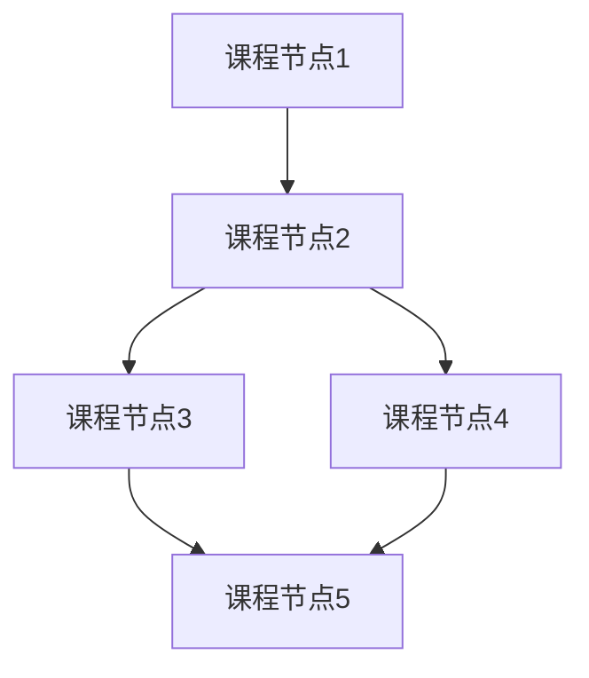
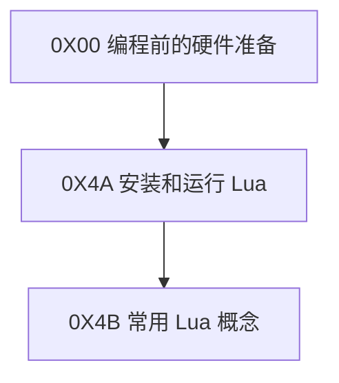
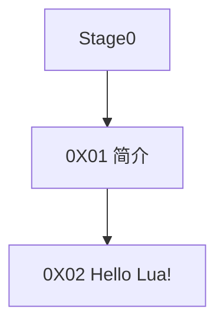

# 目录

## 图例

节点间的连线表示学习顺序关系。当一个课程节点有多个指向它的箭头时，需要把每一个箭头出发点都学完再学习它。当一个课程节点发出多个箭头时，选择一个自己感兴趣的优先学习即可。

## Stage0 前言

* [0X00 编程前的硬件准备](./Stage0/0X00编程前的硬件准备.md)

## Stage1 入门

* [0X01 简介](./Stage1/0X01简介.md)
* [0X02 Hello Lua](./Stage1/0X02HelloLua.md)

## Stage2 基础

## Stage3 字符串处理

## Stage4 理解函数

## Stage5 表结构

## Stage6 流程控制

## Stage7 模块

## Stage8 正则表达式

## Stage9 虚拟机和文件

## StageA 元表

## StageB 异常处理

## StageC 线程

s

## StageD 调试

前置:Stage1~C

0X49 调试
0X4A Hooks

后续:暂无

## StageE 与C交互

前置：Stage1~D

0X4B 与C交互
0X4C 从C调用Lua（1）
0X4D 从C调用Lua（2）
0X4E 从Lua调用C

后续：暂无