# 目录

## 图例

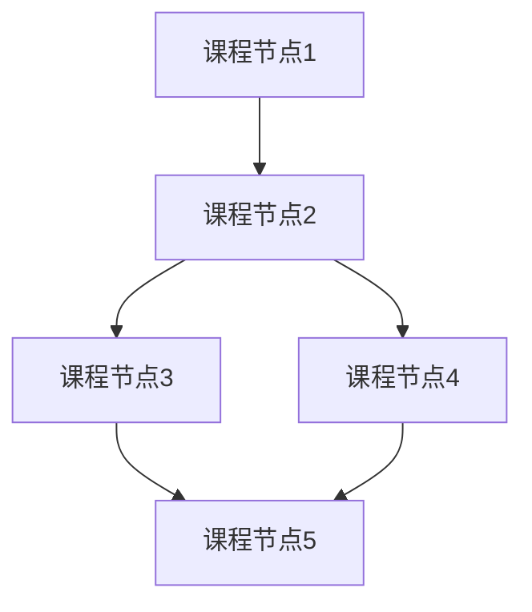

节点间的连线表示学习顺序关系。当一个课程节点有多个指向它的箭头时，需要把每一个箭头出发点都学完再学习它。当一个课程节点发出多个箭头时，选择一个自己感兴趣的优先学习即可。

## Stage0 前言

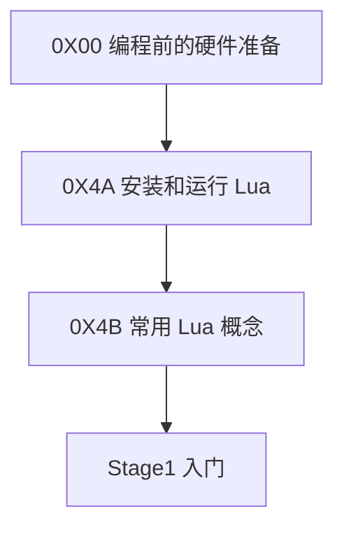

* [0X00 编程前的硬件准备](./Stage0/0X00编程前的硬件准备.md)

## Stage1 入门

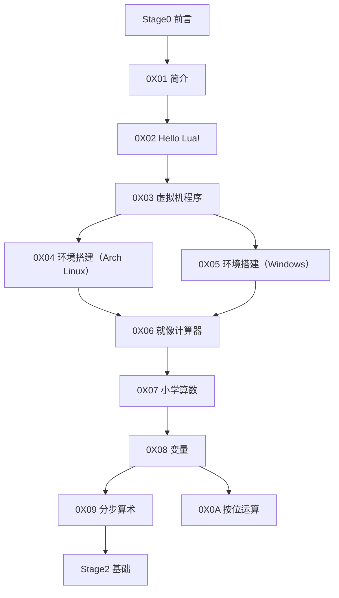

* [0X01 简介](./Stage1/0X01简介.md)
* [0X02 Hello Lua](./Stage1/0X02HelloLua.md)
* [0X03 虚拟机程序](./Stage1/0X03虚拟机程序.md)
* [0X04 环境搭建（Arch Linux）](./Stage1/0X04环境搭建（Arch_Linux）.md)
* [0X05 环境搭建（Windows）](./Stage1/0X05环境搭建（Windows）.md)
* [0X06 就像计算器](./Stage1/0X06就像计算器.md)
* [0X07 小学算数](./Stage1/0X07小学算数.md)
* [0X08 变量](./Stage1/0X08变量.md)
* [0X09 分步算术](./Stage1/0X09分步算术.md)
* [0X0A 按位运算](./Stage1/0X0A按位运算.md)

## Stage2 基础

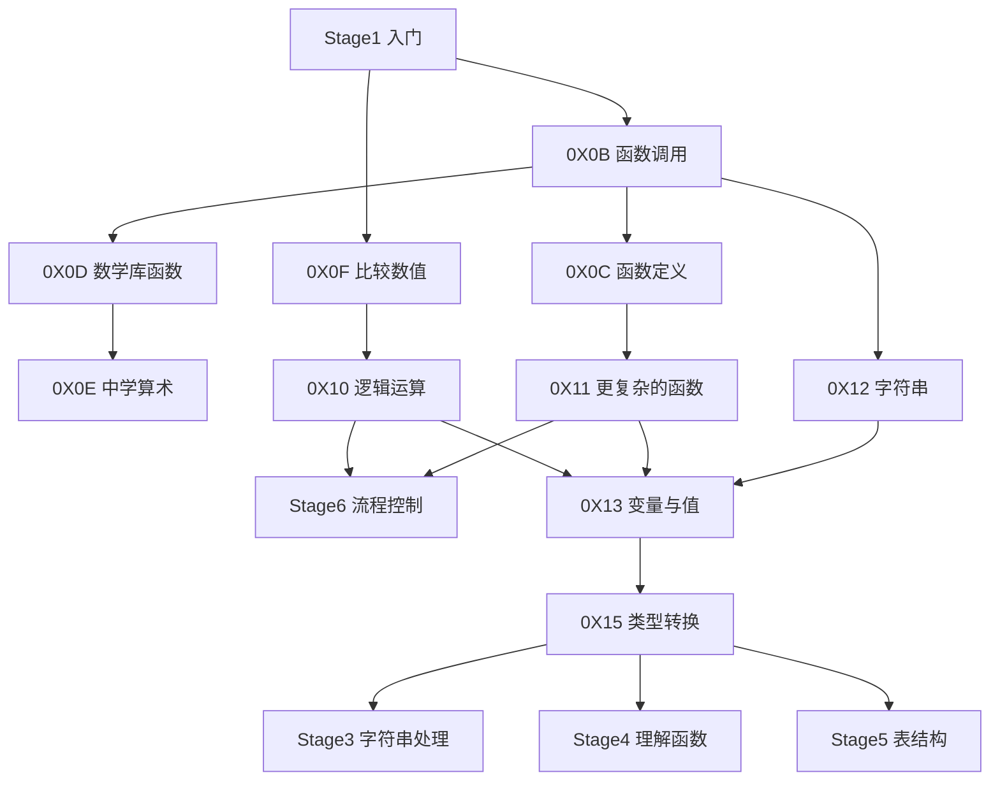

* [0X0B 函数调用](./Stage2/0X0B函数调用.md)
* [0X0C 函数定义](./Stage2/0X0C函数定义.md)
* [0X0D 数学库函数](./Stage2/0X0D数学库函数.md)
* [0X0E 中学算术](./Stage2/0X0E中学算术.md)
* [0X0F 比较数值](./Stage2/0X0F比较数值.md)
* [0X10 逻辑运算](./Stage2/0X10逻辑运算.md)
* [0X11 更复杂的函数](./Stage2/0X11更复杂的函数.md)
* [0X12 字符串](./Stage2/0X12字符串.md)
* [0X13 变量与值](./Stage2/0X13变量与值.md)
* [0X15 类型转换](./Stage2/0X15类型转换.md)

## Stage3 字符串处理

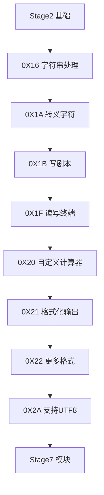

* [0X16 字符串处理](./Stage3/0X16字符串处理.md)
* [0X1A 转义字符](./Stage3/0X1A转义字符.md)
* [0X1B 写剧本](./Stage3/0X1B写剧本.md)
* [0X1F 读写终端](./Stage3/0X1F读写终端.md)
* [0X20 自定义计算器](./Stage3/0X20自定义计算器.md)
* [0X21 格式化输出](./Stage3/0X21格式化输出.md)
* [0X22 更多格式](./Stage3/0X22更多格式.md)
* [0X2A 支持UTF8](./Stage3/0X2A支持UTF8.md)

## Stage4 理解函数

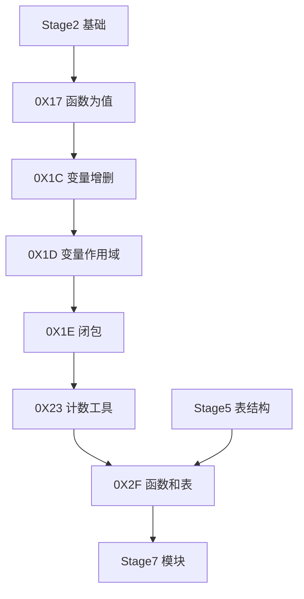

* [0X17 函数为值](./Stage4/0X17函数为值.md)
* [0X1C 变量增删](./Stage4/0X1C变量增删.md)
* [0X1D 变量作用域](./Stage4/0X1D变量作用域.md)
* [0X1E 闭包](./Stage4/0X1E闭包.md)
* [0X23 计数工具](./Stage4/0X23计数工具.md)
* [0X2F 函数和表](./Stage4/0X2F函数和表.md)

## Stage5 表结构

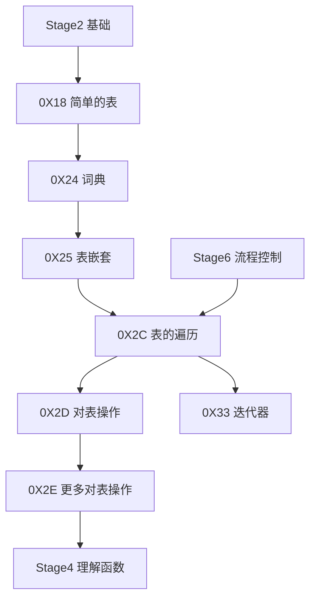

* [0X18 简单的表](./Stage5/0X18简单的表.md)
* [0X24 词典](./Stage5/0X24词典.md)
* [0X25 表嵌套](./Stage5/0X25表嵌套.md)
* [0X2C 表的遍历](./Stage5/0X2C表的遍历.md)
* [0X2D 对表操作](./Stage5/0X2D对表操作.md)
* [0X2E 更多对表操作](./Stage5/0X2E更多对表操作.md)
* [0X33 迭代器](./Stage5/0X33迭代器.md)

## Stage6 流程控制

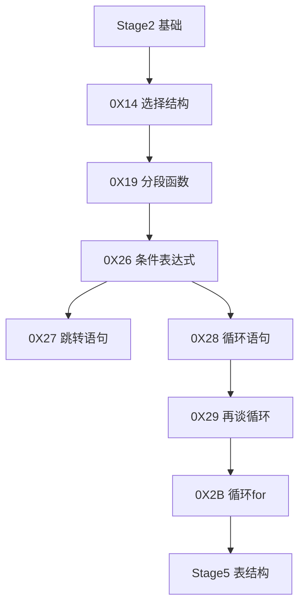

* [0X14 选择结构](./Stage6/0X14选择结构.md)
* [0X19 分段函数](./Stage6/0X19分段函数.md)
* [0X26 条件表达式](./Stage6/0X26条件表达式.md)
* [0X27 跳转语句](./Stage6/0X27跳转语句.md)
* [0X28 循环语句](./Stage6/0X28循环语句.md)
* [0X29 再谈循环](./Stage6/0X29再谈循环.md)
* [0X2B 循环for](./Stage6/0X2B循环for.md)

## Stage7 模块

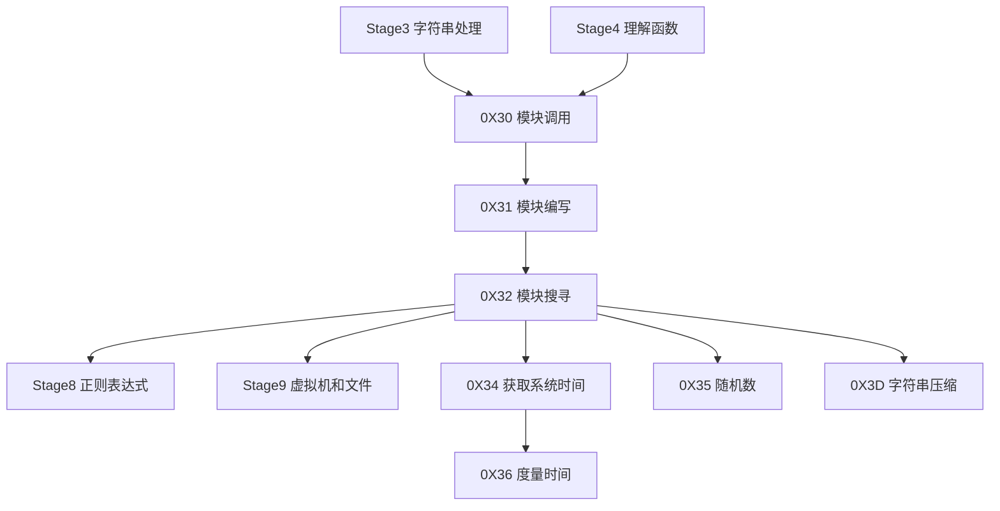

* [0X30 模块调用](./Stage7/0X30模块调用.md)
* [0X31 模块编写](./Stage7/0X31模块编写.md)
* [0X32 模块搜寻](./Stage7/0X32模块搜寻.md)
* [0X34 获取系统时间](./Stage7/0X34获取系统时间.md)
* [0X35 随机数](./Stage7/0X35随机数.md)
* [0X36 度量时间](./Stage7/0X36度量时间.md)
* [0X3D 字符串压缩](./Stage7/0X3D字符串压缩.md)

## Stage8 正则表达式

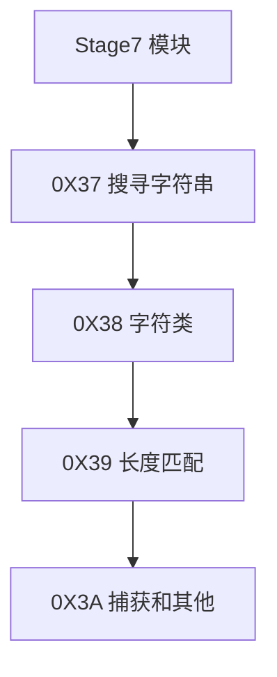

* [0X37 搜寻字符串](./Stage8/0X37搜寻字符串.md)
* [0X38 字符类](./Stage8/0X38字符类.md)
* [0X39 长度匹配](./Stage8/0X39长度匹配.md)
* [0X3A 捕获和其他](./Stage8/0X3A捕获和其他.md)

## Stage9 虚拟机和文件

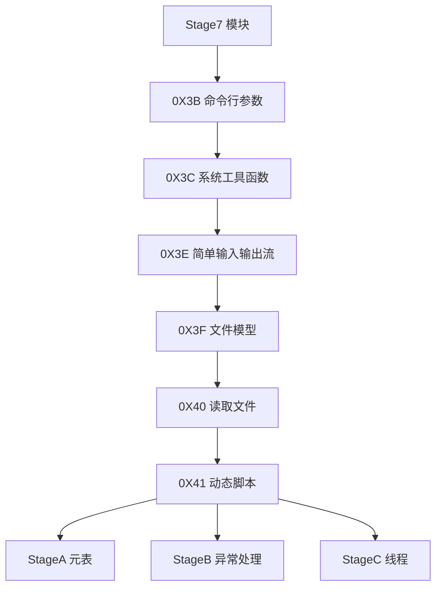

* [0X3B 命令行参数](./Stage9/0X3B命令行参数.md)
* [0X3C 系统工具函数](./Stage9/0X3C系统工具函数.md)
* [0X3E 简单输入输出流](./Stage9/0X3E简单输入输出流.md)
* [0X3F 文件模型](./Stage9/0X3F文件模型.md)
* [0X40 读取文件](./Stage9/0X40读取文件.md)
* [0X41 动态脚本](./Stage9/0X41动态脚本.md)

## StageA 元表

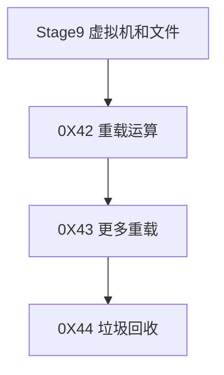

* [0X42 重载运算](./StageA/0X42重载运算.md)
* [0X43 更多重载](./StageA/0X43更多重载.md)
* [0X44 垃圾回收](./StageA/0X44垃圾回收.md)

## StageB 异常处理

## StageC 线程

s

## StageD 调试

前置:Stage1~C

0X49 调试
0X4A Hooks

后续:暂无

## StageE 与C交互

前置：Stage1~D

0X4B 与C交互
0X4C 从C调用Lua（1）
0X4D 从C调用Lua（2）
0X4E 从Lua调用C

后续：暂无