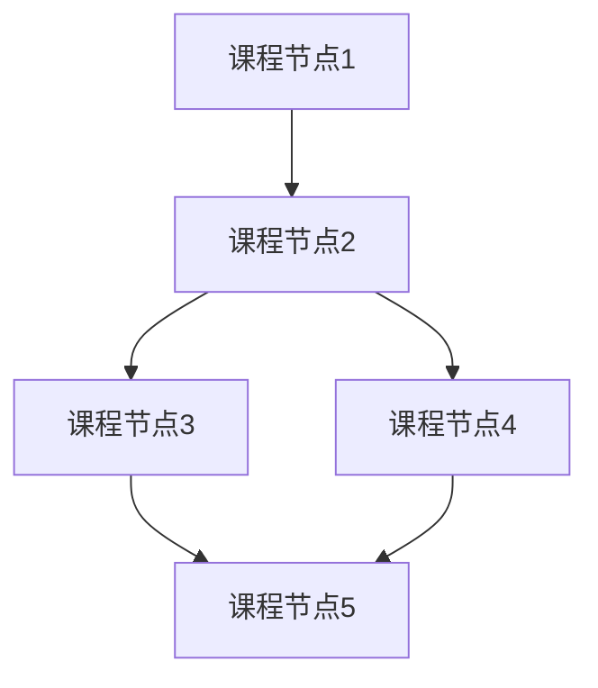
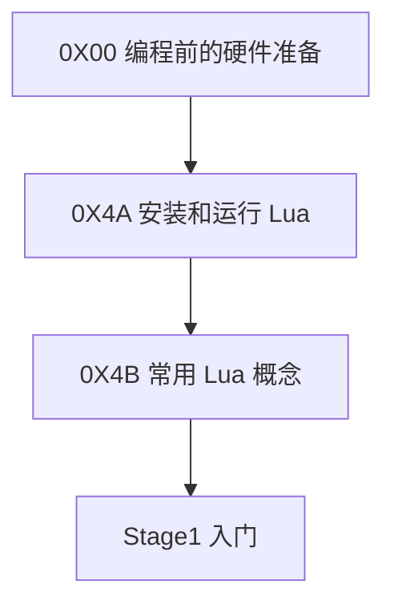
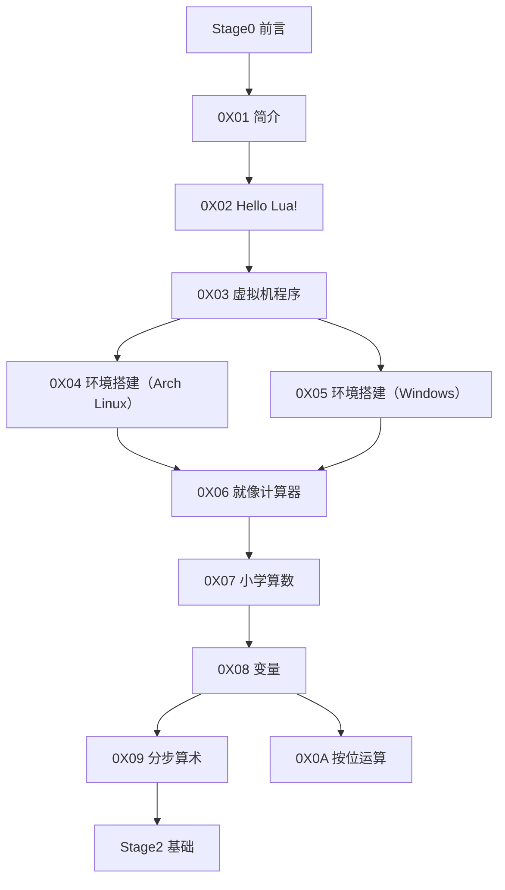
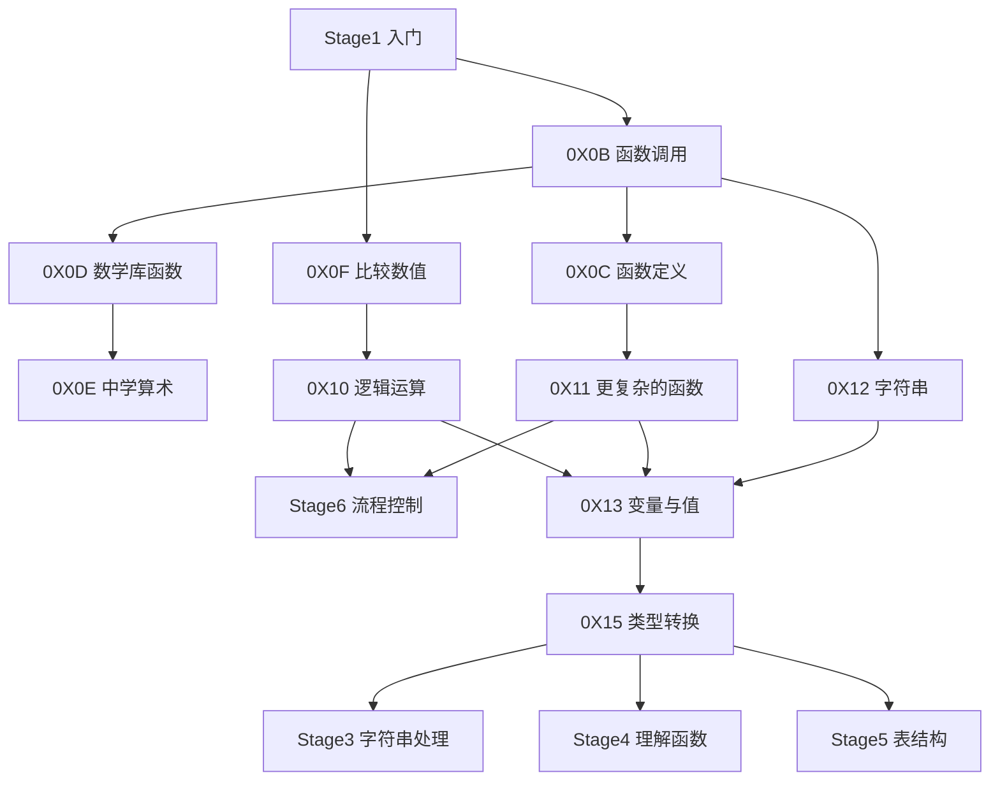
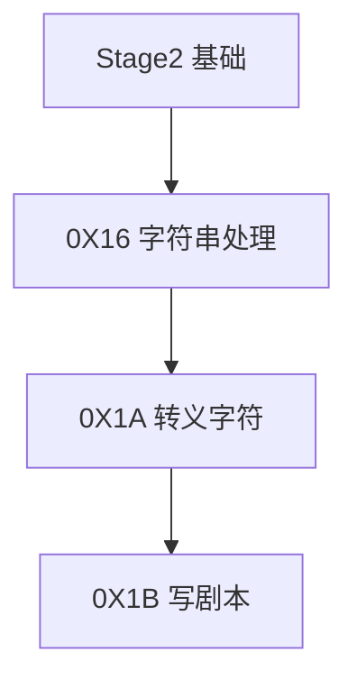
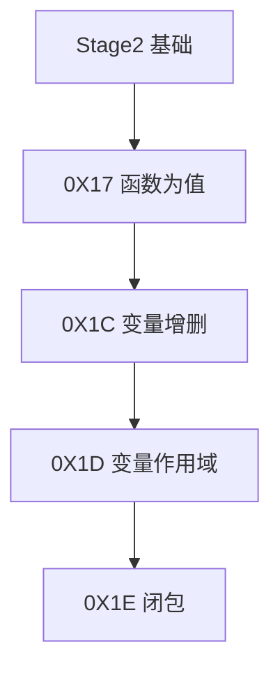
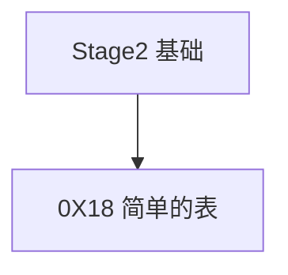
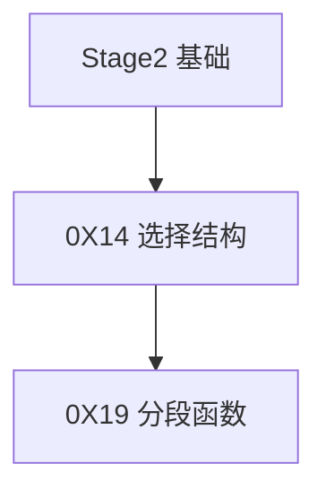

# 目录

## 图例

节点间的连线表示学习顺序关系。当一个课程节点有多个指向它的箭头时，需要把每一个箭头出发点都学完再学习它。当一个课程节点发出多个箭头时，选择一个自己感兴趣的优先学习即可。

## Stage0 前言

* [0X00 编程前的硬件准备](./Stage0/0X00编程前的硬件准备.md)

## Stage1 入门

* [0X01 简介](./Stage1/0X01简介.md)
* [0X02 Hello Lua](./Stage1/0X02HelloLua.md)
* [0X03 虚拟机程序](./Stage1/0X03虚拟机程序.md)
* [0X04 环境搭建（Arch Linux）](./Stage1/0X04环境搭建（Arch_Linux）.md)
* [0X05 环境搭建（Windows）](./Stage1/0X05环境搭建（Windows）.md)
* [0X06 就像计算器](./Stage1/0X06就像计算器.md)
* [0X07 小学算数](./Stage1/0X07小学算数.md)
* [0X08 变量](./Stage1/0X08变量.md)
* [0X09 分步算术](./Stage1/0X09分步算术.md)
* [0X0A 按位运算](./Stage1/0X0A按位运算.md)

## Stage2 基础

* [0X0B 函数调用](./Stage2/0X0B函数调用.md)
* [0X0C 函数定义](./Stage2/0X0C函数定义.md)
* [0X0D 数学库函数](./Stage2/0X0D数学库函数.md)
* [0X0E 中学算术](./Stage2/0X0E中学算术.md)
* [0X0F 比较数值](./Stage2/0X0F比较数值.md)
* [0X10 逻辑运算](./Stage2/0X10逻辑运算.md)
* [0X11 更复杂的函数](./Stage2/0X11更复杂的函数.md)
* [0X12 字符串](./Stage2/0X12字符串.md)
* [0X13 变量与值](./Stage2/0X13变量与值.md)
* [0X15 类型转换](./Stage2/0X15类型转换.md)

## Stage3 字符串处理

* [0X16 字符串处理](./Stage3/0X16字符串处理.md)
* [0X1A 转义字符](./Stage3/0X1A转义字符.md)
* [0X1B 写剧本](./Stage3/0X1B写剧本.md)

## Stage4 理解函数

* [0X17 函数为值](./Stage4/0X17函数为值.md)
* [0X1C 变量增删](./Stage4/0X1C变量增删.md)
* [0X1D 变量作用域](./Stage4/0X1D变量作用域.md)
* [0X1E 闭包](./Stage4/0X1E闭包.md)

## Stage5 表结构

* [0X18 简单的表](./Stage5/0X18简单的表.md)

## Stage6 流程控制

* [0X14 选择结构](./Stage6/0X14选择结构.md)
* [0X19 分段函数](./Stage6/0X19分段函数.md)

## Stage7 模块

## Stage8 正则表达式

## Stage9 虚拟机和文件

## StageA 元表

## StageB 异常处理

## StageC 线程

s

## StageD 调试

前置:Stage1~C

0X49 调试
0X4A Hooks

后续:暂无

## StageE 与C交互

前置：Stage1~D

0X4B 与C交互
0X4C 从C调用Lua（1）
0X4D 从C调用Lua（2）
0X4E 从Lua调用C

后续：暂无